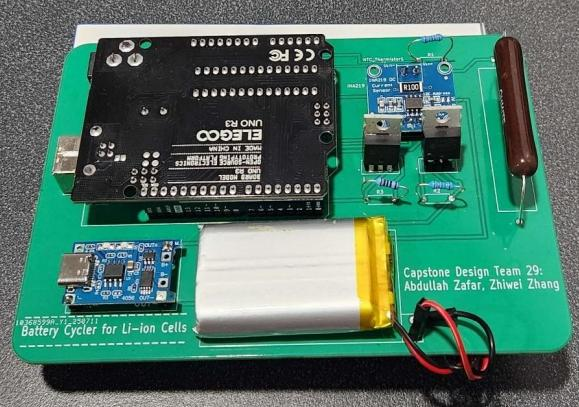
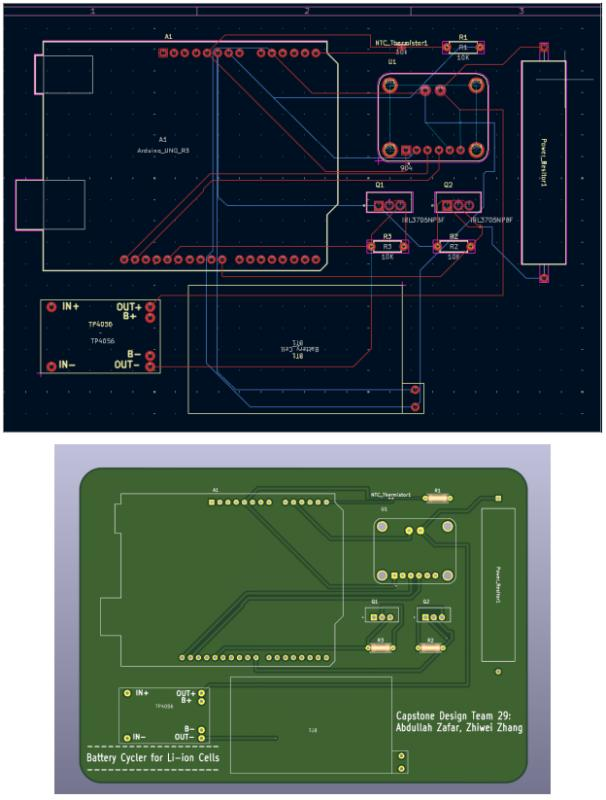
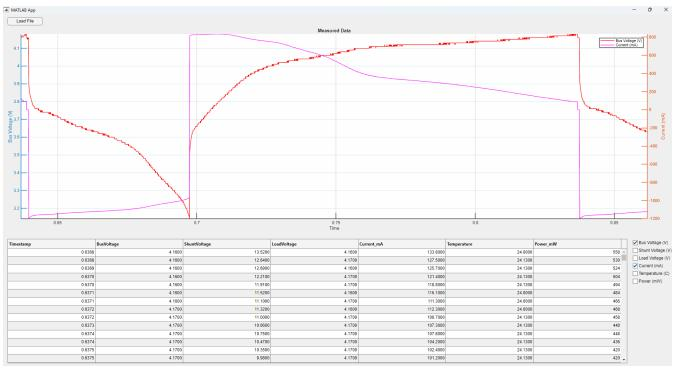

# Lithium-ion_Battery_Cycler_Capstone_Design_Project
Designed and developed a low-cost automated single-cell lithium-ion battery cycler for controlled charge and discharge testing. The system integrates a custom PCB, microcontroller-based control, and real-time data acquisition using Python and MATLAB for visualization and analysis.

### Assembled PCB Hardware
The completed, soldered PCB used for the battery cycler system.

---

### PCB Schematic & 3D Render (KiCad)
Schematic and 3D render showing component placement and overall hardware design.

---

### MATLAB Standalone Application 
Custom MATLAB App Designer interface used for real-time visualization and analysis of charge/discharge data.

---

## Technologies Used
- **Embedded Systems:** Arduino / Microcontroller-based control  
- **Programming:** Python, MATLAB  
- **Hardware Design:** KiCad (PCB Design & Layout)  
- **Data Processing:** CSV logging, real-time plotting (Matplotlib / MATLAB)  

---

## Results
The system enables reliable and repeatable charge/discharge testing of lithium-ion cells, with real-time monitoring and post-processing for performance evaluation.

---

## Note
This project was developed as part of a fourth-year capstone design project at the University of Windsor.

